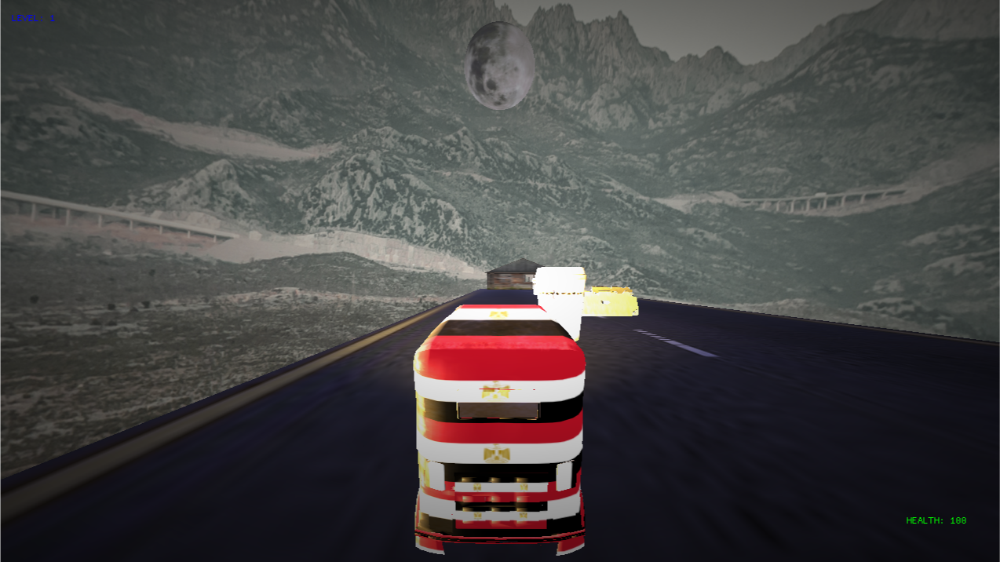

# Drive Me Home 🚗

Exciting game that takes you through 3 adrenaline-rushing levels, each more challenging than the last. Crafted in C++ using OpenGL, your objective is to navigate your vehicle past a series of obstacles, collecting health objects along the way. But beware! The penalty of obstacles changes according to the level, and your health depletes with every collision. Run out of health, and it's game over!

## Gameplay 🎮

You start the game with 100 health points. Each level increases the difficulty and the penalty of the obstacles. The game ends when you finishes the 3 levels.

### Controls:

- **A**: Move left
- **D**: Move right
- **Shift**: Increase the speed of crafting
- **Scroll**: Change camera view

## Demo 🎥

Watch the gameplay demo on YouTube!

## Getting Started 💻

Follow these steps to run the game:

1. Clone the repository.
2. Install Visual Studio Compiler with verison new.
3. Install any IDE and CMake.
4. Build the project from the IDE.
5. Run the project.

## Included Libraries 📚

The game uses the following libraries:

- glfw 3.3
- glad 2
- glm 0.9.9.8
- imgui v1.78
- json 3.9.1
- irrKlang
- stb
- tinyobjloader v1.0.6

## Have Fun! 🚀
